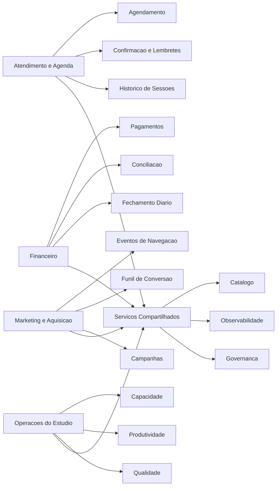

# 03 - Domínios e Serviços

## Domínios de Negócio

- Atendimento e Agenda
- Financeiro
- Marketing e Aquisição
- Operações do Estúdio

## Serviços por Domínio

### Atendimento e Agenda

- Serviço de agendamento
- Serviço de confirmação e lembretes
- Serviço de histórico de sessões

### Financeiro

- Serviço de pagamentos
- Serviço de conciliação
- Serviço de fechamento diário

### Marketing e Aquisição

- Serviço de eventos de navegação
- Serviço de funil de conversão
- Serviço de campanhas

### Operações do Estúdio

- Serviço de capacidade por tatuador
- Serviço de produtividade
- Serviço de qualidade (no-show, retrabalho, avaliação)

### Serviços Compartilhados

- Catálogo de dados e metadados
- Observabilidade e monitoramento
- Governança e qualidade de dados

## Diagrama de Domínios e Serviços

