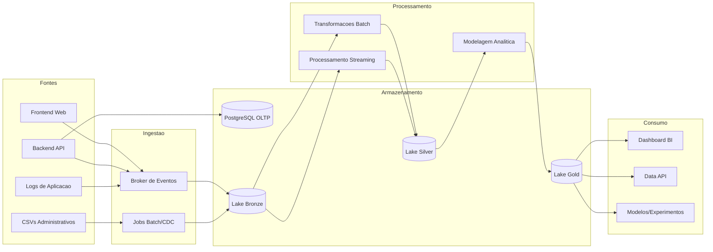

# 04 - Arquitetura e Fluxo de Dados

## Arquitetura Escolhida

Foi escolhida uma arquitetura **Lakehouse com fluxo híbrido (batch + streaming)**, inspirada no padrão **Lambda simplificado** e na camada **Medalhão (Bronze, Silver, Gold)**.

Justificativa:

- atende uso operacional + analítico;
- separa ingestão bruta de camadas tratadas;
- permite evolução incremental com baixo acoplamento;
- viável em ambiente local (Docker) para a disciplina.

## Fluxo Ponta a Ponta

## Caminhos Batch e Streaming

- **Streaming:** frontend/backend/logs -> broker -> Bronze -> processamento incremental -> Silver/Gold.
- **Batch:** extrações do OLTP e CSVs -> Bronze -> transformações agendadas -> Silver/Gold.

## Trade-offs

- **Acoplamento:** reduzido por separação em camadas e contratos de dados.
- **Escalabilidade:** crescimento independente de ingestão, transformação e consumo.
- **Disponibilidade:** componentes isolados diminuem impacto de falhas pontuais.
- **Confiabilidade:** reprocessamento possível a partir de Bronze.
- **Reversibilidade:** decisões permitem troca gradual de ferramentas sem reescrever todo o fluxo.
