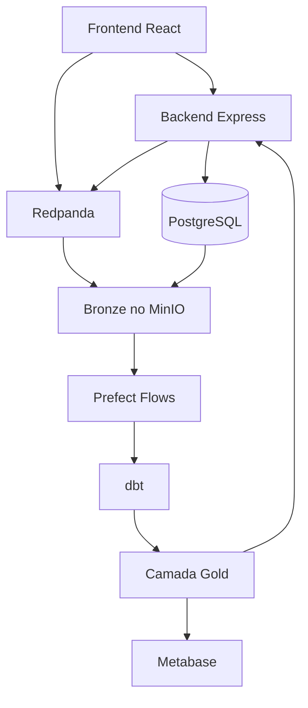

# 05 - Tecnologias e Justificativas

## Visão Geral

A seleção prioriza ferramentas open-source, custo baixo e execução local via Docker para viabilizar a disciplina.

## Ingestão

- **Broker de eventos:** Redpanda (API compatível com Kafka).
- **Motivo:** setup mais simples para ambiente local mantendo paradigma de streaming.

## Armazenamento

- **Operacional:** PostgreSQL.
- **Lakehouse:** MinIO (S3 compatível) com arquivos Parquet.
- **Motivo:** separação OLTP/analítico e flexibilidade para dados brutos e curados.

## Processamento e Transformação

- **Batch:** Python + pandas/polars.
- **Modelagem analítica:** dbt.
- **Streaming:** consumidor Python/Node para agregações incrementais.
- **Motivo:** curva de aprendizado acessível, forte adoção no mercado e reprodutibilidade.

## Orquestração

- **Prefect** para agendamento e dependências de jobs.
- **Motivo:** leve para protótipo, boa observabilidade e integração simples com Docker.

## Serviço/Consumo

- **Dashboards:** Metabase.
- **Consumo por aplicação:** API backend (Node/Express) expondo dados curados.
- **Motivo:** entrega visual rápida para stakeholders e integração com frontend.

## Segurança, Gestão, DataOps e Governança

- Controle de acesso por ambiente e variáveis de configuração.
- Versionamento de código e pipelines em GitHub.
- Qualidade de dados com validações de schema e testes em transformações.
- Monitoramento de execução (jobs, latência, falhas) com logs estruturados.

## Integração entre tecnologias

